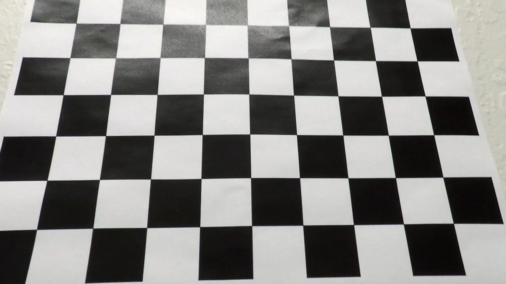
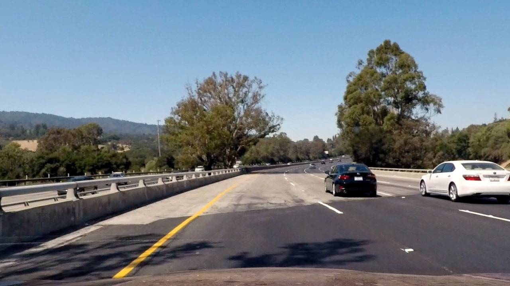
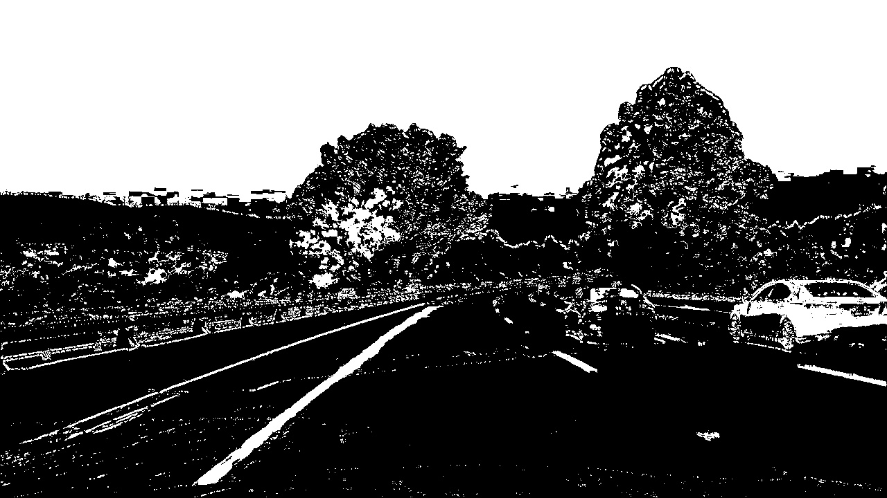
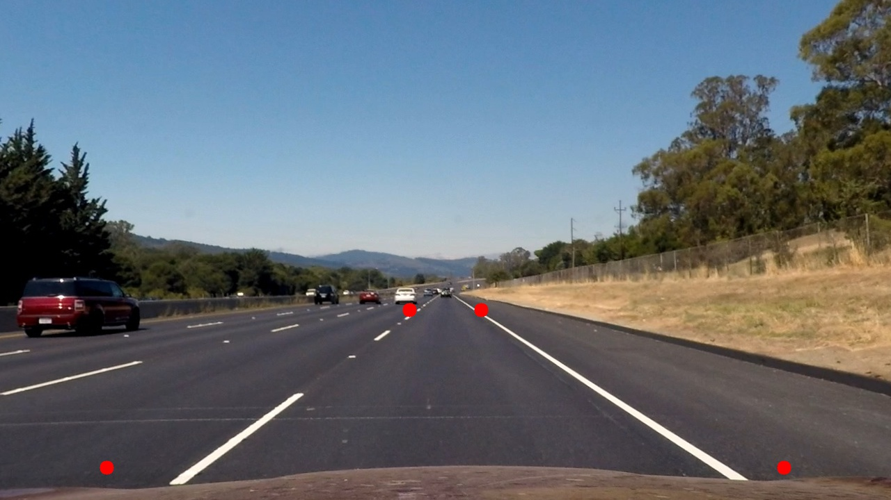
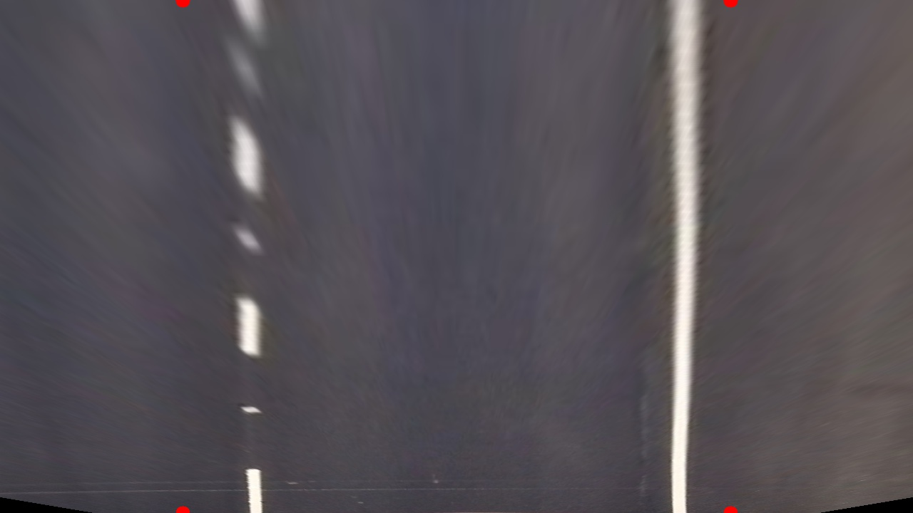
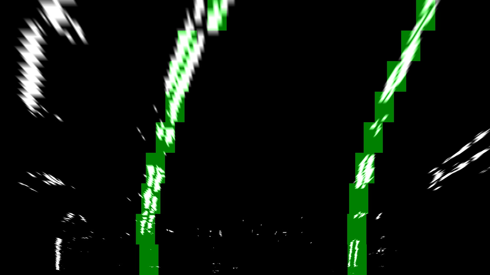
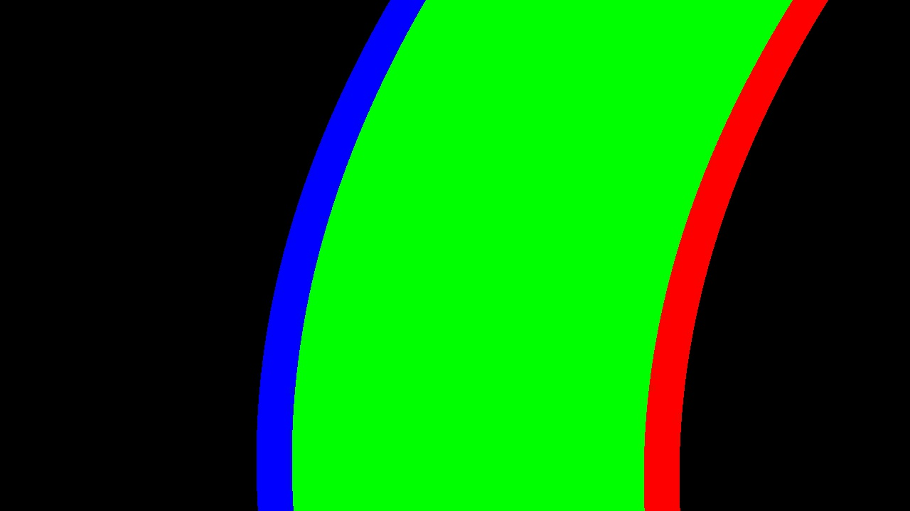
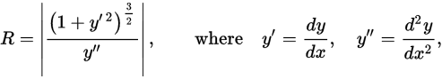
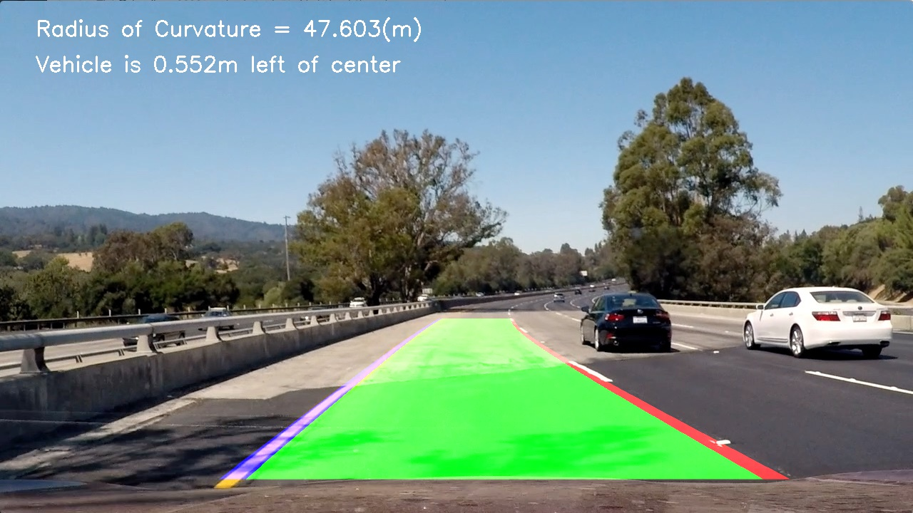

**Advanced Lane Finding Project**
---


The goals / steps of this project are the following:

* Compute the camera calibration matrix and distortion coefficients given a set of chessboard images.
* Apply a distortion correction to raw images.
* Use color transforms, gradients, etc., to create a thresholded binary image.
* Apply a perspective transform to rectify binary image ("birds-eye view").
* Detect lane pixels and fit to find the lane boundary.
* Determine the curvature of the lane and vehicle position with respect to center.
* Warp the detected lane boundaries back onto the original image.
* Output visual display of the lane boundaries and numerical estimation of lane curvature and vehicle position.

[//]: # (Image References)

[image1]: ./examples/undistort_output.png "Undistorted"
[image2]: ./test_images/test1.jpg "Road Transformed"
[image3]: ./examples/binary_combo_example.jpg "Binary Example"
[image4]: ./examples/warped_straight_lines.jpg "Warp Example"
[image5]: ./examples/color_fit_lines.jpg "Fit Visual"
[image6]: ./examples/example_output.jpg "Output"
[video1]: ./project_video.mp4 "Video"

## [Rubric](https://review.udacity.com/#!/rubrics/571/view) Points

### Here I will consider the rubric points individually and describe how I addressed each point in my implementation.  

---

### Writeup / README

#### 1. Provide a Writeup / README that includes all the rubric points and how you addressed each one.  You can submit your writeup as markdown or pdf.  [Here](https://github.com/udacity/CarND-Advanced-Lane-Lines/blob/master/writeup_template.md) is a template writeup for this project you can use as a guide and a starting point.  

You're reading it!

### Camera Calibration

#### 1. Briefly state how you computed the camera matrix and distortion coefficients. Provide an example of a distortion corrected calibration image.

The code for this step is contained in the second code cell of the IPython notebook located in "./Advanced_Lane_Detection_tracker.ipynb".  

I start by preparing "object points", which will be the (x, y, z) coordinates of the chessboard corners in the world. Here I am assuming the chessboard is fixed on the (x, y) plane at z = 0, such that the object points are the same for each calibration image.  Thus, `objp` is just a replicated array of coordinates, and `objpoints` will be appended with a copy of it every time I successfully detect all chessboard corners in a test image.  `imgpoints` will be appended with the (x, y) pixel position of each of the corners in the image plane with each successful chessboard detection.  

I then used the output `objpoints` and `imgpoints` to compute the camera calibration and distortion coefficients using the `cv2.calibrateCamera()` function.  I applied this distortion correction to the test image using the `cv2.undistort()` function and obtained this result:

<center> original image </center>
<center> </center>

<center> Undistorted image </center>
<center> </center>

### Pipeline (single images)

#### 1. Provide an example of a distortion-corrected image.

To demonstrate this step, I will describe how I apply the distortion correction to one of the test images like this one:
<center> original image </center>

<center> </center>

<center> Undistorted image </center>

<center> </center>


#### 2. Describe how (and identify where in your code) you used color transforms, gradients or other methods to create a thresholded binary image.  Provide an example of a binary image result.

I used a combination of color and Sobel gradient thresholds to generate a binary image.

In the `color_thresh()` function, I utilized the HLS color spectrum and set thresholds for all three of the H, L, and S channels.

In the `abs_sobel_thresh()` function I defined the Sobel threshold criterion for both vertical and horizontal directions.

Here's an example of my output for this step.  

<center> </center>


#### 3. Describe how (and identify where in your code) you performed a perspective transform and provide an example of a transformed image.

The code for my perspective transform was shown in the 6th code cell of the IPython notebook `Advance_Lane_Detection_tracker.ipynb`).  The `cv2.warpPerspective` function takes as inputs an image (`img`), as well as source (`src`) and destination (`dst`) points.  I chose the dynamic the source and destination points depending on the input image, in the following manner:

```python
# Offset in the image
offset = img_size[0] * 0.2

# Source points
src = np.float32([[img.shape[1]*(0.5 - mid_width/2), img.shape[0]*height_pct],
                  [img.shape[1]*(0.5 + mid_width/2), img.shape[0]*height_pct],
                  [img.shape[1]*(0.5 + btm_width/2), img.shape[0]*btm_trim],
                  [img.shape[1]*(0.5 - btm_width/2), img.shape[0]*btm_trim]])
# Destination points        
dst = np.float32([[offset, 0],
                  [img_size[0] - offset, 0],
                  [img_size[0] - offset, img_size[1]],
                  [offset, img_size[1]]])
```

With the parameters below:

| Parameters        | Value |
|:-------------:|:-------------:|
| bottom width / btm_width     | 0.76        |
| bottom trim / btm_trim      | 0.935      |
| middle width / mid_width     | 0.08      |
| height percentage / height_pct  | 0.62        |


I verified that my perspective transform was working as expected by drawing the `src` and `dst` points onto a test image and its warped counterpart to verify that the lines appear parallel in the warped image.

<center> Undistored Image with source points drawn </center>
<center> </center>

<center> Warped result with destination points drawn </center>

<center> </center>


#### 4. Describe how (and identify where in your code) you identified lane-line pixels and fit their positions with a polynomial?

Then I implemented a sliding window approach to the lane lines with a 2nd order polynomial. Note that a Tracker class was implemented to help store and find centroids in the sliding windows when searching for the lane line.

The sliding window search was shown below:
<center> </center>


Then a second-order polynomial was fitted to find the left and right lanes:
<center> </center>


#### 5. Describe how (and identify where in your code) you calculated the radius of curvature of the lane and the position of the vehicle with respect to center.

I calculated the curvature of the curve using the formula

<center> </center>


#### 6. Provide an example image of your result plotted back down onto the road such that the lane area is identified clearly.

I implemented this step in cell 6 in `Advance_Lane_Detection_tracker.ipynb`.  Here is an example of my result on a test image:

<center> </center>


---

### Pipeline (video)

#### 1. Provide a link to your final video output.  Your pipeline should perform reasonably well on the entire project video (wobbly lines are ok but no catastrophic failures that would cause the car to drive off the road!).

Here's a [link to my video result](./output_tracked.mp4)

The script to generate this video is `Advance_Lane_Detection_video.ipynb`.

---

### Discussion

#### 1. Briefly discuss any problems / issues you faced in your implementation of this project.  

The biggest challenge was to filter out the noise and generate a good binary image. It was necessary to choose good color spectrum and thresholding functions. After some trials and tests, I found that using HLS colormap worked best. Combining thresholding functions in all three H, L, S channels, the preprocessed image was a good feed to the perspective transform function.

#### 2. What could you do to make it more robust and efficient?

The pipeline defined above works very well on the input video, but I noticed that the performance isn't very good. On my laptop with a two-core CPU, the processing rate is about 6-7 frames per second. This is not good enough for instantaneous use. We need to optimize the algorithm, or use the C++ version of the OpenCV library to achieve at least 60 FPS processing rate.
